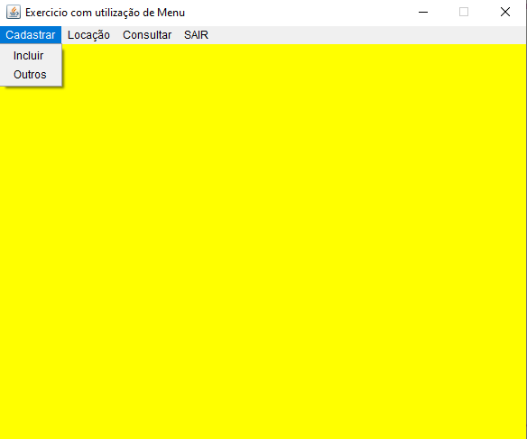
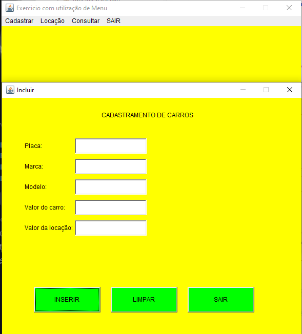
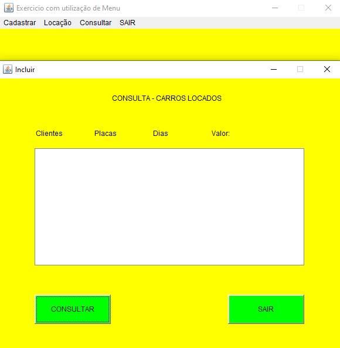
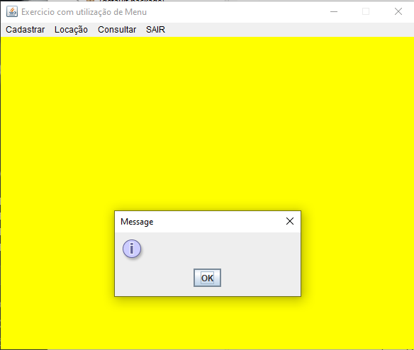
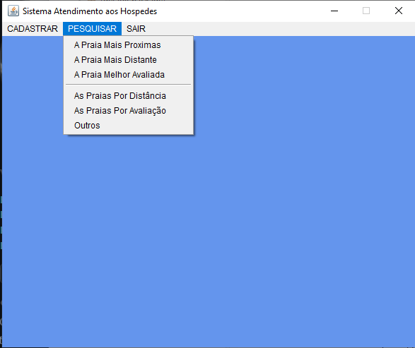

# Sistema Java com interface gráfica

Projeto desenvolvido para treinamento, Explorando algumas funcionalidades:
* Frame, Button, Label e TextField;
* Posicionamento manual dos componentes com setLocation() e setSize();
* Uso da classe Dimension para definir tamanhos;
* Tratamento de eventos com ActionListener;
* Captura de dados digitados pelo usuário;
* Conversão de String para double;
* Operações matemáticas;
* Organização do código utilizando uma classe interna (ButtonHandler).

# Conceitos praticados

Durante o desenvolvimento foram utilizados conceitos importantes de Java, como:

* Classes e objetos;
* Herança;
* Classes internas;
* Interfaces;
* Eventos e listeners;
* Componentes de interface gráfica;
* Conversão de tipos;
* Operações matemáticas;
* Organização e manipulação de elementos visuais.

## Tecnologias
* Java
* MySQL
* JDBC
* Eclipse

## Telas dos projeto

